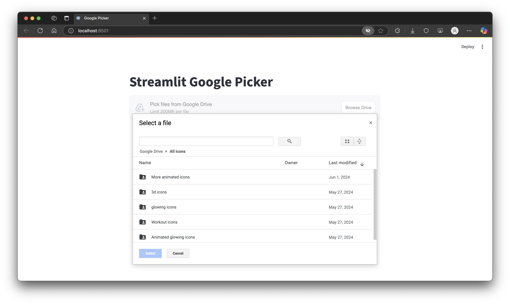

# Streamlit Google Picker

**A Streamlit component to select files and folders from Google Drive using the official Google Picker.**

This component lets you embed the Google Drive file picker directly in your Streamlit app, allowing your users to select files or folders from their Google Drive and work with them as Python file-like objects.

---

## 🚀 Features

- **Pick files or folders from Google Drive**
- **Multi-select support** (pick multiple files) (pick folder in progress)
- **Filter by file type or MIME type** (e.g. PDF, images, etc.)
- **Native Streamlit feel, like `st.file_uploader`**

---

## 📸 Demo

<p align="center">
  
</p>

---

## 🛠️ Installation

```bash
pip install streamlit-google-picker
```

_For latest dev, use `pip install git+https://github.com/LounesAl/streamlit-google-picker`_

---

## ⚙️ Requirements

You will need a Google Cloud project with proper OAuth 2.0 and API setup in the [google cloud console](https://console.cloud.google.com/apis/credentials):

1. **Create an OAuth2 Client ID** (Web application ! **Important**)
2. **Set Redirect URI** (e.g. `http://localhost:8501` for local)
3. **Create an API key** then **Enable** both **Google Drive API** and **Google Picker API**

**Set these in your environment:**

```env
GOOGLE_CLIENT_ID=your-client-id.apps.googleusercontent.com
GOOGLE_CLIENT_SECRET=your-client-secret
GOOGLE_API_KEY=your-api-key
```

---

## ✨ Basic usage

**After the user is authenticated (OAuth2, see examples), use the picker:**

```python
import streamlit as st
from streamlit_google_picker import google_picker

token = st.session_state["token"]["access_token"]  # From your OAuth2 flow
CLIENT_ID = os.environ.get("GOOGLE_CLIENT_ID")
API_KEY = os.environ["GOOGLE_API_KEY"]
APP_ID = CLIENT_ID.split("-")[0]

uploaded_files = google_picker(
    label="Pick files from Google Drive",
    token=token,
    apiKey=API_KEY,
    appId=APP_ID,
    accept_multiple_files=True,
    type=["pdf", "png", "jpg"],   # file extensions or MIME types
    allow_folders=True,
    nav_hidden=False,
    key="google_picker",
)

if uploaded_files:
    for uploaded_file in uploaded_files:
        st.write(f"Filename: {uploaded_file.name}, Size: {uploaded_file.size_bytes}")
        # To get file content:
        data = uploaded_file.read()  # This downloads the file on-demand!
        # Display or process as needed
        st.write(f"Bytes: {len(data)}")
```

**Folder selection: (In Progress)**
If the user selects a folder, all files inside (recursively) are returned as `UploadedFile` objects.

**You can also use it with a single file (returns a single object or None):**

```python
uploaded_file = google_picker(accept_multiple_files=False, ...)
if uploaded_file:
    st.write(uploaded_file.name)
    content = uploaded_file.read()
```

---

## 📥 Return Format

- If `accept_multiple_files=True`, returns a **list** of `UploadedFile` objects (like Streamlit’s).
- If `accept_multiple_files=False`, returns a single `UploadedFile` or `None`.

Each `UploadedFile` behaves like a Python file object (subclass of `io.BytesIO`):

```python
uploaded_file.name       # Original filename
uploaded_file.size_bytes # File size in bytes
uploaded_file.type       # MIME type
uploaded_file.url        # Direct Google Drive URL
uploaded_file.id         # File ID
uploaded_file.read()     # Reads bytes (downloads on demand)
```

---

## 🧩 Full OAuth2 + Picker Example

A typical flow:

1. User authenticates via Google OAuth2 (e.g. with [streamlit-oauth](https://github.com/streamlit/streamlit-oauth))
2. Store `access_token` in `st.session_state` and DB + auto refresh token (Here we use secrects.json for simulation)
3. Pass token to `google_picker()`
4. Get the selected files as `UploadedFile` objects.

See [`example.py`](./streamlit_google_picker/example.py) for a full sample.

---

## 🧑‍💻 Development

- Clone this repo
- Install backend (Python) and frontend (React) requirements
- Run `npm install && npm start` in `frontend/` for hot-reload
- Develop Streamlit component as usual

---

## 💡 Credits and Docs

- [Streamlit Components](https://docs.streamlit.io/library/components)
- [Google Picker API Docs](https://developers.google.com/picker/docs)
- [Google Drive API Docs](https://developers.google.com/drive/api)
- [streamlit-oauth](https://github.com/streamlit/streamlit-oauth)

---

**Found a bug or have a feature request? [Open an issue!](https://github.com/LounesAl/streamlit-google-picker/issues)**
