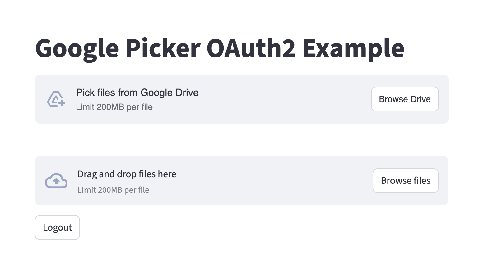

# streamlit-google-picker

**A Streamlit component to select files and folders from Google Drive with the official Google Picker.**

This component lets you embed the Google Drive file picker directly in your Streamlit app. Your users can pick files (e.g. PDFs, images, etc.) or folders from their Google Drive, after authenticating with Google.

---

## 🚀 Features

✅ Pick files or folders from Google Drive
✅ Support for multi-select
✅ Restrict to specific MIME types (e.g. PDF, PNG)
✅ Seamless integration with Streamlit apps
✅ Works alongside local `st.file_uploader`

---

## 📸 Demo

> Example picker button:

<p align="center">
  
</p>

---

## 🛠️ Installation

```bash
pip install streamlit-google-picker
```

*(Replace with your PyPI name if you publish it there. Otherwise explain how to install it from GitHub.)*

---

## ⚙️ Requirements

You need to set up a Google Cloud project and OAuth2 credentials:

1️⃣ Create OAuth2 client ID (Web application)
2️⃣ Set authorized redirect URI to your Streamlit app URL (e.g. `http://localhost:8501` for local)
3️⃣ Enable **Google Drive API** and **Google Picker API**
4️⃣ Get:

* **Client ID**
* **Client Secret**
* **API Key**
* **Project number (App ID)**

Store these in your environment variables:

```
GOOGLE_CLIENT_ID=your-client-id
GOOGLE_CLIENT_SECRET=your-client-secret
API_KEY=your-api-key
GOOGLE_PROJECT_NUMBER=your-project-number
```

---

## ✨ Usage

Below is a minimal example of how to use the **Google Picker component** in your Streamlit app **after you have already done OAuth2 login** and have an access token.

> **Important:** This snippet assumes you already got `access_token` from your OAuth2 flow.

```python
import streamlit as st
from streamlit_google_picker import google_picker

# Example token you got from OAuth2 flow
token = "YOUR_ACCESS_TOKEN"

API_KEY = "YOUR_GOOGLE_API_KEY"
APP_ID = "YOUR_GOOGLE_PROJECT_NUMBER"

result = google_picker(
    label="Pick files from Google Drive",
    token=token,
    apiKey=API_KEY,
    appId=APP_ID,
    accept_multiple_files=True,       # Allow selecting multiple files
    type=["pdf", "png"],              # Restrict file types
    allow_folders=True,               # Allow folder selection
    nav_hidden=False,                 # Show navigation pane
    key="google_picker",
)

if result:
    st.write("Picker Result:", result)
```

---

## 📥 Result format

When the user picks files or folders, you get a JSON-like result:

```json
[
  {
    "name": "MyFile.pdf",
    "mimeType": "application/pdf",
    "id": "file_id",
    "url": "https://drive.google.com/file/d/..."
  },
  ...
]
```

You can use this info to download files via the Google Drive API.

---

## 🧩 Example full app

If you want OAuth2 login + Picker in Streamlit, your app would:

✅ Show "Sign in with Google" (OAuth2 flow)
✅ Get and store `access_token` in `st.session_state`
✅ Call `google_picker()` with that token

Your repo already has an example (`app.py` or similar) showing the full flow.

---

## 🧑‍💻 Development

* Clone this repo
* Install requirements
* Develop your Streamlit component (frontend in React, backend in Python)

---

## 📜 License

MIT

---

## 💡 Acknowledgments

* [Streamlit Components](https://docs.streamlit.io/library/components)
* [Google Picker API Docs](https://developers.google.com/picker/docs)